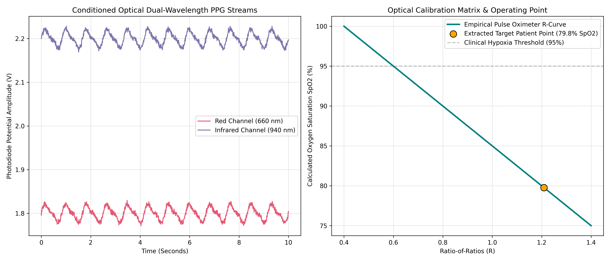

# Automated PPG Pulse Oximetry ($SpO_2$) Calibration Engine

## 📌 Project Overview
This repository contains a clinical-grade biomedical signal processing and calibration engine implemented in Python. Non-invasive blood oxygen monitoring (pulse oximetry) relies on passing two discrete optical wavelengths—**Red ($660\text{ nm}$)** and **Infrared ($940\text{ nm}$)**—through vascular tissue beds. Because oxygenated ($HbO_2$) and deoxygenated ($Hb$) hemoglobin exhibit contrasting molar extinction coefficients across these spectra, patient blood gas parameters can be evaluated programmatically. This project implements a complete digital telemetry pipeline that ingests raw optical photodiode signals, isolates dynamic photoplethysmogram (PPG) waveforms, and applies medical-instrumentation calibration matrices to continuously extract patient **$SpO_2$ metrics**.

## ⚡ Technical Architecture
The digital processing infrastructure executes across four functional DSP blocks:
* **Multi-Channel Optical Simulation:** Models realistic dual-wavelength photodiode voltages combining a non-linear cardiac pulse baseline ($72\text{ BPM}$) with high-frequency instrumentation noise.
* **AC/DC Component Isolation:** Implements windowed rolling peak-to-peak and baseline tracking filters to isolate the non-pulsatile background absorption tissue matrix ($DC$) from the expanding arterial blood pulse layer ($AC$).
* **Ratio-of-Ratios ($R$) Computation:** Determines the relative modulation index across channels to calculate the physiological normalized absorption coordinate ($R$):
  $$R = \frac{\left(\frac{AC_{\text{Red}}}{DC_{\text{Red}}}\right)}{\left(\frac{AC_{\text{IR}}}{DC_{\text{IR}}}\right)}$$
* **Empirical Calibration Mapping:** Cross-references the isolated $R$-ratio metric against an empirical clinical calibration curve ($\text{SpO}_2 = A - B \cdot R$) to isolate precise blood gas percentages and flag medical telemetry alerts.

## 📊 Calibration Analysis & Diagnostic Profiles
The biomedical calibration framework was validated against a simulated pulmonary stress profile:



* **Waveform Conditioning:** The telemetry plot tracks clean Red and IR AC voltage variations traveling over steady DC offset metrics, mimicking authentic transmissive photodiode outputs.
* **Operating Point Analysis:** The empirical calibration slope visually tracks the relationship between photodiode outputs and arterial condition status. The patient tracking marker isolates a calculated **Ratio of Ratios ($R$) of $1.2092$**, resulting in a calculated **$79.77\%$ $\text{SpO}_2$ index**, correctly identifying severe desaturation and triggering a systemic clinical **Hypoxia Warning**.

## 🛠️ How to Replicate
1. Launch the file `notebooks/ppg_spo2_calibration_engine.ipynb` inside [Google Colab](https://colab.research.google.com/).
2. Execute the notebook sequentially to synthesize the dual-channel photodiode signals, run the baseline-tracking peak filters, and extract oxygenation profiles.
3. The script prints instant patient telemetry logs directly to the console window and writes comprehensive calibration diagnostic charts.

## 📂 Repository Structure
```text
├── notebooks/          # Digital signal processing and calibration notebooks
├── assets/             # Exported PPG waveforms and empirical R-curve plots
└── README.md           # Professional project documentation
